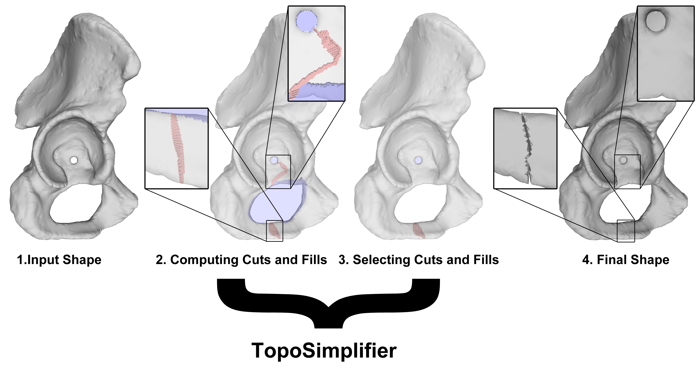

# To Cut or to Fill: A Global Optimization Approach to Topological Simplification

[Dan Zeng](#), [Erin Chambers](https://cs.slu.edu/~chambers/), [David Letscher](https://cs.slu.edu/people/letscher), [Tao Ju](https://www.cse.wustl.edu/~taoju/)
 *ACM Transaction on Graphics (Proceedings of SIGGRAPH Asia 2020)* 

[`Project Page`](https://danzeng8.github.io/topo-simplifier)
[`Dataset`](https://danzeng8.github.io/topo-simplifier/examples.zip)

## Abstract

We present a novel algorithm for simplifying the topology of a 3D shape, which is characterized by the number of connected components, handles, and cavities. Existing methods either limit their modifications to be only cutting or only filling, or take a heuristic approach to decide where to cut or fill. We consider the problem of finding a globally optimal set of cuts and fills that achieve the simplest topology while minimizing geometric changes. We show that the problem can be formulated as graph labelling, and we solve it by a transformation to the Node-Weighted Steiner Tree problem. When tested on examples with varying levels of topological complexity, the algorithm shows notable improvement over existing simplification methods in both topological simplicity and geometric distortions.

## TopoSimplifier

The program here simplifies the topology a volumetric representation of a 3D shape using a global optimization method. It takes as input a voxelized shape and outputs a topologically simplified voxelized shape. 

TopoSimplifier has been developed for Windows 10 (Visual Studio 2019), and has not yet been tested on other platforms.

