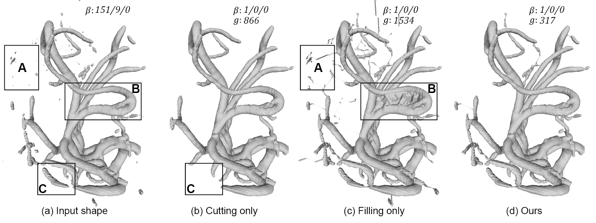

# To Cut or to Fill: A Global Optimization Approach to Topological Simplification

[Dan Zeng](#), [Erin Chambers](https://cs.slu.edu/~chambers/), [David Letscher](https://cs.slu.edu/people/letscher), [Tao Ju](https://www.cse.wustl.edu/~taoju/)
 *ACM Transaction on Graphics (Proceedings of SIGGRAPH Asia 2020)* 

[`Project Page`](https://danzeng8.github.io/topo-simplifier)
[`Paper`](https://danzeng8.github.io/topo-simplifier/#paper)
[`Dataset`](https://danzeng8.github.io/topo-simplifier/examples.zip)

## Abstract

We present a novel algorithm for simplifying the topology of a 3D shape, which is characterized by the number of connected components, handles, and cavities. Existing methods either limit their modifications to be only cutting or only filling, or take a heuristic approach to decide where to cut or fill. We consider the problem of finding a globally optimal set of cuts and fills that achieve the simplest topology while minimizing geometric changes. We show that the problem can be formulated as graph labelling, and we solve it by a transformation to the Node-Weighted Steiner Tree problem. When tested on examples with varying levels of topological complexity, the algorithm shows notable improvement over existing simplification methods in both topological simplicity and geometric distortions.

## TopoSimplifier

The program here simplifies the topology a volumetric representation of a 3D shape using a global optimization method. It takes as input a voxelized shape and outputs a topologically simplified voxelized shape. 

TopoSimplifier has been developed for Windows 10 (Visual Studio 2019), and has not yet been tested on other platforms.

## Building TopoSimplifier

You will need Visual Studio 2019.

Open the Visual Studio solution file TopoSimplifier.sln. Go to Build > Build Solution. After it successfully builds, TopoSimplifier.exe will be updated in the main TopoSimplifier directory. 

It is preferred to use Windows SDK Version 10.0. You can check to see if you have this by going to Project > Properties > Configuration Properties > General > Windows SDK Version.

## Running TopoSimplifier

TopoSimplifier accepts three possible input types:
* .tif: typically for distance field volumes
* .dist: alternate format for distance field volumes
* directory with .png image slices, with each .png having a 4 digit name, ordered like 0000.png...0001.png...0002.png...NNNN.png. These are usually appropriate for image volumes from biomedical and plant imaging (e.g. X-ray CT, MRI, Cryo-EM).

The only required arguments are the input and output file. For a .tif or a .dist, this looks like:

	TopoSimplifier input.tif output.tif

Note that if the input is a .dist file, the output will be a .tif in order to make visualization easier. Hence .tif files are preferred between these two formats.

For a directory with .png image slices, this looks like:

	TopoSimplifier input/ output/

Read on for discussion about other parameters.

## Visualization of input and output

To visualize the input and output (assuming they are .tif or image slices), we highly recommend [`UCSF Chimera`](https://www.cgl.ucsf.edu/chimera/), a visualization software developed for the biomedical imaging community. UCSF Chimera allows for the visualization of both the input and output using an iso-surface and image volume, and also allows for exporting the input and output to different formats such as a .ply mesh.

Opening the input / output:
After opening up the UCSF Chimera Software, and go to File > Open. If the input / output is in .tif format, simply click on the file. If the input / output is a sequence of .png image slices in a directory, navigate to that directory in the file browser, then shift + drag your mouse to select all the .png slices in the directory. Click Open in the file browser.

Visualizing the shape: 

Go to Tools > Volume Data > Volume Viewer. Then in the Volume Viewer window change Style to "surface", step size to "1", and draw the iso-surface bar to the shape threshold which defines the shape being simplified. In the case of distance fields, this threshold will be 0. For other cases, this may vary but should match what you chose for the --S parameter (see below two sections).

Here is an example visualization in Chimera for the tree example in our dataset, using the settings above:

Input shape: 

Output shape:

Mouse controls: 
Rotate: left-draw
Translate: center-drag
Zoom" right-draw

There are no known software to visualize .dist files, because this is a customized format produced by Vega-FEM as part of their signed distance field package. 

